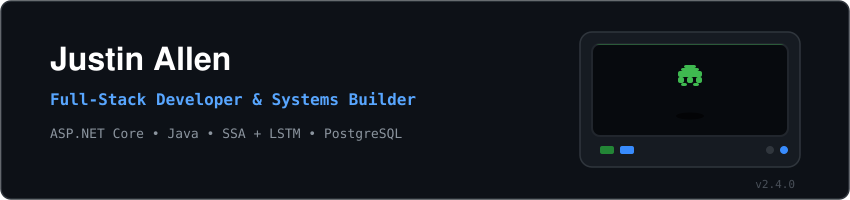

  

`>` `building resilient and responsive systems.`

---

---

### 📊 Contribution Activity

  

---

### 🚀 Active Projects

* **🍱 Le Katsu MNL** – An inventory management and sales forecasting system for franchise operations, applying **SSA** and **LSTM models** for advanced analytics.
* **🛡️ SafePoint (IRS)** – A full-stack Incident Reporting System designed for responsive community safety management.

---

### 🔍 Current Focus & Interests

* 🛡️ **Cybersecurity:** Learning deep dive attack classifications, vulnerabilities, and digital defense.
* 📖 **Literature:** Dedicated reader of webnovels, light novels, and manhwa.

---

### 🌌 Stats & Social

  
  
    
  

### 🤝 Let's Collaborate!

  
PS: Inquiries and questions are always welcome, I'll try my best to answer in time when I'm available.

---

  Last Updated: September 2026 | Based in Quezon City & Caloocan City, PH! Hello World!
   
  

