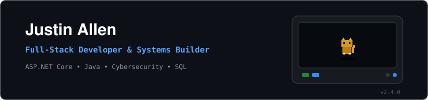
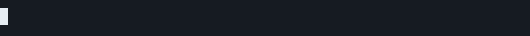

  
 
  
 
  

---

  
   
  

---

### Contribution Activity

  

---

### Current Focus & Interests

* Cybersecurity: Learning deep dive attack classifications, vulnerabilities, and digital defense.
* Literature: Dedicated reader of webnovels, light novels, and manhwa.

---

### Stats & Social

  

  
  

### Let's Collaborate!

  

PS: Inquiries and questions are always welcome, I'll try my best to answer in time when I'm available. You can also view my projects, and certificates on my portfolio under, just click the link on top or in my profile links.

---

  Last Updated: September 2026 | Based in Quezon City & Caloocan City, PH!
   
  

